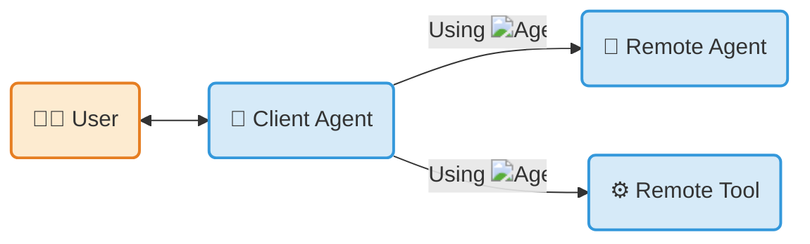

Documentation

Extensions

Specification

Resources

[ Tutorials ](tutorials/)

[ DeepLearning.AI Course ](https://goo.gle/dlai-a2a)

Community

[ Blog ](blog/)

Categories

# 

An open protocol enabling communication and interoperability between opaque agentic applications.

An open standard enabling users to connect agents to tools and data through MCP, and to other agents through A2A.

An open standard enabling developers to expose portable tools through MCP and interoperable agents through A2A.

[Get started](tutorials/python/1-introduction/) [Read the spec](specification/)

## What is A2A Protocol?[¶](#what-is-a2a-protocol "Permanent link")

The **Agent2Agent (A2A) Protocol** is an open standard for seamless communication and collaboration between AI agents. In a world where agents are built using diverse frameworks and by different vendors, A2A provides the definitive common language for agent interoperability.

Build with **[ ADK](https://google.github.io/adk-docs/)** *(or any framework)*, equip with **[ MCP](https://modelcontextprotocol.io)** *(or any tool)*, and communicate with ** A2A**, to remote agents, local agents, and humans.

## Key Features[¶](#key-features "Permanent link")

-  **Interoperability**

  Connect agents built on different platforms (LangGraph, CrewAI, Semantic Kernel, custom solutions) to create powerful, composite AI systems.

-  **Complex Workflows**

  Enable agents to delegate sub-tasks, exchange information, and coordinate actions to solve complex problems that a single agent cannot.

-  **Secure & Opaque**

  Agents interact without needing to share internal memory, tools, or proprietary logic, ensuring security and preserving intellectual property.

-  **Extensible**

  Add capabilities through formal protocol [extensions and custom bindings](topics/extension-and-binding-governance/), governed by a tiered promotion process so the core stays stable.

## Get started with A2A[¶](#get-started-with-a2a "Permanent link")

-  **Read the Introduction**

  Understand the core ideas behind A2A.

  [ What is A2A?](topics/what-is-a2a/)

  [ Key Concepts](topics/key-concepts/)

-  **Dive into the Specification**

  Explore the detailed technical definition of the A2A protocol.

  [ Protocol Specification](specification/)

-  **Follow the Tutorials**

  Build your first A2A-compliant agent with our step-by-step Python quickstart.

  [ Hands-on-Tutorial](tutorials/python/1-introduction/)

-  **Explore Code Samples**

  See A2A in action with sample clients, servers, and agent framework integrations.

  [ GitHub Samples](https://github.com/a2aproject/a2a-samples)

-  **Download the Official SDKs**

  [ Python](https://github.com/a2aproject/a2a-python)

  [ JavaScript](https://github.com/a2aproject/a2a-js)

  [ Java](https://github.com/a2aproject/a2a-java)

  [ C#/.NET](https://github.com/a2aproject/a2a-dotnet)

  [ Golang](https://github.com/a2aproject/a2a-go)

  [ Rust](https://github.com/a2aproject/a2a-rs)

-  **Video** Intro in under 8 min

-  **Course** [DeepLearning.AI](https://deeplearning.ai) - Intro to A2A

  

## How A2A Works with MCP[¶](#how-a2a-works-with-mcp "Permanent link")

The Model Context Protocol (MCP) and the A2A Protocol are not competitors — they are highly complementary. They solve two different problems and are designed to work together.

- **MCP is for agent-to-tool communication:** it standardizes how an agent connects to its tools, APIs, and resources to get information. See [Model Context Protocol](https://modelcontextprotocol.io/).
- **A2A is for agent-to-agent communication:** as a universal, decentralized standard, A2A lets independent agents — including those using MCP — discover each other, delegate tasks, and share results.

Use MCP to equip an individual agent with the specific tools it needs to do its job (e.g., access to a GitHub repository or a SQL database). Use A2A to let that specialized agent securely collaborate with other agents across different frameworks.

[ A2A and MCP — deeper dive](topics/a2a-and-mcp/)

## What A2A Is Not[¶](#what-a2a-is-not "Permanent link")

A2A is a focused protocol. To set expectations, here is what it explicitly does not try to be:

- **Not an agent development kit** like LangGraph, CrewAI, or ADK for building agentic applications. A2A is the communication layer between agents built with any of these.
- **Not a sub-agent or tool-call protocol.** A2A does not specify how an agent talks to its own sub-agents or how it invokes tools — use your framework's native primitives, or MCP, for those.
- **Not a replacement for [MCP](https://modelcontextprotocol.io/).** MCP standardizes agent-to-tool communication; A2A standardizes agent-to-agent communication. They are complementary (see [above](#how-a2a-works-with-mcp)).
- **Not an interactive messaging app** like Slack, Discord, WhatsApp, or Telegram. A2A is a machine-to-machine protocol for autonomous agents.

## Governance & Open Source[¶](#governance-open-source "Permanent link")

A2A was originally developed by Google and donated to the Linux Foundation. It is maintained by a Technical Steering Committee with representatives from AWS, Cisco, Google, IBM Research, Microsoft, Salesforce, SAP, and ServiceNow, and supported by a broad community of [partners](partners/).

Join the community on [Discord](https://discord.gg/a2aprotocol) to connect with contributors, ask questions, and discuss the protocol.

For details on how the project is run, see [`GOVERNANCE.md`](https://github.com/a2aproject/A2A/blob/main/GOVERNANCE.md) and [`MAINTAINERS.md`](https://github.com/a2aproject/A2A/blob/main/MAINTAINERS.md).

## License[¶](#license "Permanent link")

The A2A Protocol is licensed under the [Apache License 2.0](https://github.com/a2aproject/A2A/blob/main/LICENSE) and welcomes [contributions](https://github.com/a2aproject/A2A/blob/main/CONTRIBUTING.md) from the community.

Back to top
