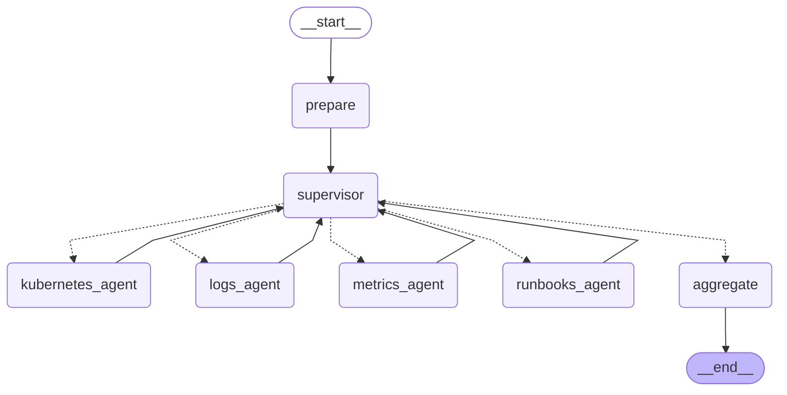

# SRE Agent Architecture

```mermaid
---
config:
  flowchart:
    curve: linear
---
graph TD;
	__start__([<p>__start__</p>]):::first
	prepare(prepare)
	supervisor(supervisor)
	kubernetes_agent(kubernetes_agent)
	logs_agent(logs_agent)
	metrics_agent(metrics_agent)
	runbooks_agent(runbooks_agent)
	aggregate(aggregate)
	__end__([<p>__end__</p>]):::last
	__start__ --> prepare;
	kubernetes_agent --> supervisor;
	logs_agent --> supervisor;
	metrics_agent --> supervisor;
	prepare --> supervisor;
	runbooks_agent --> supervisor;
	supervisor -.-> aggregate;
	supervisor -.-> kubernetes_agent;
	supervisor -.-> logs_agent;
	supervisor -.-> metrics_agent;
	supervisor -.-> runbooks_agent;
	aggregate --> __end__;
	classDef default fill:#f2f0ff,line-height:1.2
	classDef first fill-opacity:0
	classDef last fill:#bfb6fc

```
