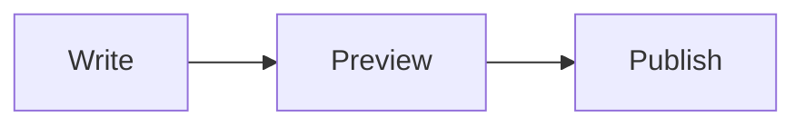

# Mermaid

> Create diagrams from a code fence

Use the `mermaid` language on a fenced code block.

## Usage

````md

```mermaid
graph LR
  A[Write] --> B[Preview] --> C[Publish]
```
````

Docs7 keeps the source readable in Markdown exports.

## Example


```mermaid
graph LR
  A[Write] --> B[Preview] --> C[Publish]
```
